# Feature Development Workflow

This document describes the structured workflow for developing features using the starwave skills. This workflow ensures proper planning, design, and implementation phases with built-in quality checks and review processes.

## Overview

The workflow follows a four-phase approach:
1. **Requirements Gathering** - Define what needs to be built
2. **Design** - Plan how it will be built
3. **Task Planning** - Break down implementation into actionable steps
4. **Implementation** - Execute tasks incrementally

This is constantly being worked on, and will evolve over time. Each step also works for all tools, where it's recommended you set them up at the user level as their respective type:

- **Claude Code**: Skills
- **GitHub Copilot**: Prompt files
- **Cline**: Workflows

## Getting Started

The recommended way to start a new feature is with the **`/starwave:creating-spec`** skill. This orchestration skill:

1. Assesses the scope of your feature
2. Routes to either the lightweight smolspec workflow or the full spec workflow
3. Guides you through all phases with built-in review gates
4. Offers to create a feature branch when planning is complete

For smaller changes (<80 lines of code, 1-3 files), you can use **`/starwave:smolspec`** directly.

## Starwave Skills

All spec-driven development skills are organized under the `starwave` namespace:

| Skill | Purpose |
|-------|---------|
| `/starwave:creating-spec` | Main entry point - orchestrates the full workflow |
| `/starwave:smolspec` | Lightweight specification for minor changes |
| `/starwave:requirements` | Generate and refine requirements in EARS format |
| `/starwave:design` | Create design documents based on requirements |
| `/starwave:tasks` | Convert designs into actionable task lists |

## Smolspec: Lightweight Specifications

The **`/starwave:smolspec`** skill provides a streamlined alternative to the full spec workflow for smaller changes.

### When to Use Smolspec

Use smolspec when **ALL** of these apply:
- Estimated implementation <80 lines of code
- Affects 1-3 files only
- Single component with minimal dependencies
- Clear requirements that don't need extensive clarification
- No breaking changes or API modifications
- No cross-cutting concerns (security, performance, reliability)

### When to Use Full Spec

Use the full spec workflow (`/starwave:creating-spec`) when **ANY** of these apply:
- Estimated implementation >80 lines of code or >3 files
- Affects multiple subsystems or architectural boundaries
- Requires breaking changes or significant API modifications
- Impacts backward compatibility
- Involves complex business logic or multiple user workflows
- Has significant security, performance, or reliability implications

### Smolspec Process

1. **Research Phase** - Explore codebase, identify affected files, assess complexity
2. **Planning Phase** - Create `smolspec.md` with Overview, Requirements, Implementation Approach, and Risks
3. **Review Phase** - Design-critic agent reviews, user approves
4. **Task Creation** - Generate 4-10 outcome-focused tasks in `tasks.md`

### Smolspec Output

The smolspec workflow produces two files in `specs/{feature_name}/`:

**smolspec.md** - A concise document (<100 lines) containing:
- Overview (2-4 sentences)
- Requirements using MUST/SHOULD/MAY language
- Implementation Approach with specific file paths
- Risks and Assumptions

**tasks.md** - A task list compatible with `/next-task`:
- 4-10 outcome-focused tasks
- Optionally organized into 1-2 phases
- Testing distributed throughout (not consolidated at end)

### Escalation

If during smolspec planning the scope grows beyond the criteria above, the skill will recommend switching to the full spec workflow with `/starwave:requirements`.

## Workflow Phases

### Phase 1: Requirements Gathering (`/starwave:requirements`)

**Purpose**: Generate and refine requirements in EARS format based on feature ideas.

**Process**:
- Generate initial requirements based on user's feature idea
- Create `specs/{feature_name}/requirements.md` file
- Use hierarchical numbered lists with user stories and acceptance criteria
- Iterate with user through clarifying questions until requirements are complete
- Use design-critic sub-agent to critically review requirements
- Use peer-review-validator sub-agent for external validation
- Continue feedback-revision cycle until explicit user approval

**Key Constraints**:
- Must propose feature name based on user preference, branch name, or prompt content
- Must wait for user confirmation of feature name
- Must ask general questions important to requirements (e.g., backwards compatibility)
- Must use AskUserQuestion tool when offering options to the user
- Must ask clarifying questions until everything is clear
- Must get explicit approval before proceeding
- Must document decisions in `decision_log.md`

### Phase 2: Design (`/starwave:design`)

**Purpose**: Develop design document based on approved requirements.

**Process**:
- Verify requirements.md exists
- Conduct research using available tools (context7, web search)
- Create detailed `specs/{feature_name}/design.md` with required sections:
  - Overview
  - Architecture
  - Components and Interfaces
  - Data Models
  - Error Handling
  - Testing Strategy
- Include Mermaid diagrams when appropriate
- Use design-critic sub-agent to challenge design decisions
- Use peer-review-validator sub-agent for second opinion
- Get explicit user approval

**Key Constraints**:
- Must follow decisions from decision_log.md
- Must address all requirements
- Must incorporate research findings
- Must use AskUserQuestion tool when asking for input on technical decisions
- Cannot proceed without user approval

### Phase 3: Task Planning (`/starwave:tasks`)

**Purpose**: Create actionable implementation plan with coding tasks.

**Process**:
- Verify requirements.md and design.md exist
- Convert design into series of prompts for code-generation
- Create numbered checkbox list in `specs/{feature_name}/tasks.md`
- Focus on test-driven development and incremental progress
- Reference specific requirements for each task
- Ensure tasks build incrementally
- Identify any user prerequisites and create `prerequisites.md` if needed

**Key Constraints**:
- Tasks must involve writing, modifying, or testing code only
- No deployment, user testing, or non-coding activities in tasks.md
- Maximum two levels of hierarchy (1.1, 1.2, 2.1, etc.)
- Must get explicit user approval
- Manual setup tasks (Xcode config, cloud console, etc.) go in prerequisites.md

### Phase 4: Implementation (`/next-task`)

**Purpose**: Implement the next unfinished group of tasks from the task list.

**Process**:
- Use `rune next --format json` to retrieve the next unfinished task group
- Read all referenced files from front_matter_references
- Implement selected main task and ALL subtasks
- Mark completed tasks using `rune complete {task_id}`
- Stop after completing the task group for user review

**Key Constraints**:
- Must use rune CLI for task retrieval and completion tracking
- If only a single top-level task is returned, must re-run with `--phase` flag to get the full phase
- Must implement entire task group (all selected tasks and subtasks)
- Cannot proceed past selected task without user review
- Should use appropriate tools and sub-agents during implementation

## File Structure

All feature-related files are stored in `specs/{feature_name}/`:
```
specs/
└── {feature_name}/
    ├── requirements.md    # EARS format requirements
    ├── design.md          # Comprehensive design document
    ├── tasks.md           # Implementation task checklist
    ├── decision_log.md    # Decisions and rationales
    └── prerequisites.md   # (Optional) Manual setup tasks for the user
```

For smolspec features:
```
specs/
└── {feature_name}/
    ├── smolspec.md       # Combined requirements and design
    ├── tasks.md          # Implementation task checklist
    └── decision_log.md   # Decisions and rationales (if needed)
```

## Workflow Diagram

```mermaid
flowchart TD
A([Start: Feature Idea]) --> B([/starwave:creating-spec])
B --> B0{Scope<br/>Assessment}
B0 -->|Small| SM([/starwave:smolspec])
SM --> SMD[Create smolspec.md]
SMD --> SMT[Create tasks.md]
SMT --> BR{Create<br/>Branch?}
B0 -->|Large| REQ([/starwave:requirements])
REQ --> B1[Generate Initial Requirements]
B1 --> B2[Design-Critic Review]
B2 --> B3[Peer-Review Validation]
B3 --> C{Requirements<br/>Approved?}
C -->|No| D((Refine<br/>Requirements))
D --> B2
C -->|Yes| E([/starwave:design])
E --> F[Research & Analysis]
F --> G[Create Design Document]
G --> G1[Design-Critic Review]
G1 --> G2[Peer-Review Validation]
G2 --> H{Design<br/>Approved?}
H -->|No| I((Refine Design))
I --> G1
H -->|Yes| J([/starwave:tasks])
J --> K[Create Implementation Plan]
K --> L{Tasks<br/>Approved?}
L -->|No| M((Refine Tasks))
M --> L
L -->|Yes| BR
BR -->|Yes| BRC[Create Feature Branch]
BRC --> N([/next-task])
BR -->|No| N
N --> O[Find Next Incomplete Task Group]
O --> P[Implement Task Group]
P --> Q[Mark Tasks Complete]
Q --> R{More Tasks<br/>Remaining?}
R -->|Yes| S[/User Review/]
S --> N
R -->|No| T([Feature Complete])

%% --- Styling ---
style A fill:#FF7377,color:#FFFFFF,stroke:#6C6A6A,stroke-width:1px
style T fill:#FF7377,color:#FFFFFF,stroke:#6C6A6A,stroke-width:1px

style B0 fill:#FFF0CC,color:#000000,stroke:#6C6A6A,stroke-width:1px
style C fill:#FFF0CC,color:#000000,stroke:#6C6A6A,stroke-width:1px
style H fill:#FFF0CC,color:#000000,stroke:#6C6A6A,stroke-width:1px
style L fill:#FFF0CC,color:#000000,stroke:#6C6A6A,stroke-width:1px
style R fill:#FFF0CC,color:#000000,stroke:#6C6A6A,stroke-width:1px
style BR fill:#FFF0CC,color:#000000,stroke:#6C6A6A,stroke-width:1px

style D fill:#FFD6D7,color:#000000,stroke:#6C6A6A,stroke-width:1px
style I fill:#FFD6D7,color:#000000,stroke:#6C6A6A,stroke-width:1px
style M fill:#FFD6D7,color:#000000,stroke:#6C6A6A,stroke-width:1px

style S fill:#E0F7FA,color:#000000,stroke:#6C6A6A,stroke-width:1px

classDef process fill:#FCFBFB,color:#000000,stroke:#6C6A6A,stroke-width:1px
classDef subagent fill:#E8F5E9,color:#000000,stroke:#4CAF50,stroke-width:2px
classDef orchestrator fill:#E3F2FD,color:#000000,stroke:#2196F3,stroke-width:2px
class REQ,E,F,G,J,K,N,O,P,Q,B1,SM,SMD,SMT,BRC process
class B2,B3,G1,G2 subagent
class B orchestrator
```



## Key Principles

1. **Incremental Progress**: Each phase builds on the previous one
2. **User Approval**: Explicit approval required at each phase
3. **Documentation**: All decisions captured in decision_log.md
4. **Test-Driven**: Implementation focuses on testable, incremental steps
5. **Separation of Concerns**: Planning vs. implementation are distinct phases
6. **Review Cycles**: Sub-agents provide feedback at each stage

## Usage Tips

- Use `/starwave:creating-spec` as your starting point for new features
- The orchestrator will assess scope and recommend the appropriate workflow
- Use the current git branch name as the feature name when possible
- Ensure each phase is fully approved before moving to the next
- The workflow creates planning artifacts only - implementation is separate
- Tasks should be concrete and actionable by coding agents
- Each task group should be reviewed before proceeding to the next

## Additional Skills

### Commit Management (`/commit`)

**Purpose**: Format, stage, and commit changes with proper changelog management.

**Process**:
- Run all formatting and test commands
- Stage all changes (or review already staged changes)
- Create a concise summary in keepachangelog.com format
- Update CHANGELOG.md with the summary
- Extract ticket number from branch name (JIRA or GitHub issue)
- Create a multi-line commit message with appropriate prefix
- Commit the changes

**Key Constraints**:
- Must not revert code changes unless specifically asked
- Must exclude changelog changes from the summary
- Must use proper commit message prefixes ([feat], [bug], [doc], or ticket number)
- Must not include co-authored-by information

### Release Preparation (`/release-prep`)

**Purpose**: Prepare the project for a new release with quality checks and documentation updates.

**Process**:
- Run all tests and linting checks
- Check for unresolved TODO/FIXME comments
- Verify dependencies are up to date
- Update version numbers across all relevant files
- Condense unreleased changelog entries into focused release notes
- Update documentation for new features
- Prepare structured release notes with breaking changes highlighted

**Key Constraints**:
- Must not commit, tag, or create releases (user handles these)
- Must condense internal changes in changelog to focus on final user-facing results
- Must highlight breaking changes prominently
- Must verify CI/CD pipelines are passing

### Code Review (`pre-push-code-reviewer` agent)

**Purpose**: Critical review of unpushed commits before pushing to remote.

**Process**:
- Identify commits not yet pushed to remote
- Locate relevant specifications for the feature
- Review code for spec adherence, quality, testing, and documentation
- Run validation tools (linters, formatters)
- Provide actionable feedback categorized by severity

**Usage**: Invoke this agent when you want to review local commits before pushing to ensure quality.

## Skill Reference

### Starwave Skills (Spec-Driven Development)
- `/starwave:creating-spec` - Main orchestrator for the full workflow
- `/starwave:smolspec` - Lightweight specification for small changes
- `/starwave:requirements` - Requirements gathering phase
- `/starwave:design` - Design document creation phase
- `/starwave:tasks` - Task planning phase

### Implementation Skills
- `/next-task` - Implement the next task group
- `/make-it-so` - Implement all remaining tasks automatically

### Utility Skills
- `/commit` - Stage and commit changes with changelog updates
- `/release-prep {version}` - Prepare for a new release
- `/catchup` - Get up to speed on branch changes
