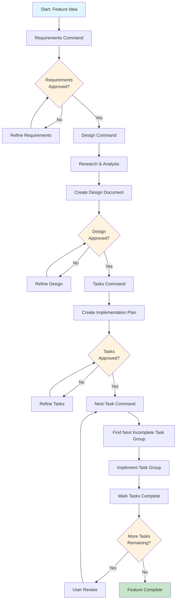

# Feature Development Workflow

This document describes the structured workflow for developing features using the requirements, design, tasks, and next-tasks commands. This workflow ensures proper planning, design, and implementation phases.

## Overview

The workflow follows a four-phase approach:
1. **Requirements Gathering** - Define what needs to be built
2. **Design** - Plan how it will be built
3. **Task Planning** - Break down implementation into actionable steps
4. **Implementation** - Execute tasks incrementally

This is constantly being worked on, and will evolve over time. Each step also works for all tools, where it's recommended you set them up at the user level as their respective type:

- **Claude Code**: Commands
- **GitHub Copilot**: Prompt files
- **Cline**: Workflows

## Workflow Phases

### Phase 1: Requirements Gathering (`requirements` command)

**Purpose**: Generate and refine requirements in EARS format based on feature ideas.

**Process**:
- Generate initial requirements based on user's feature idea
- Create `agents/{feature_name}/requirements.md` file
- Use hierarchical numbered lists with user stories and acceptance criteria
- Iterate with user through clarifying questions until requirements are complete
- Use design-critic and peer-review-validator sub-agents for review
- Continue feedback-revision cycle until explicit user approval

**Key Constraints**:
- Must propose feature name and wait for user confirmation
- Must ask clarifying questions until everything is clear
- Must get explicit approval before proceeding
- Must document decisions in `decision_log.md`

### Phase 2: Design (`design` command)

**Purpose**: Develop comprehensive design document based on approved requirements.

**Process**:
- Verify requirements.md exists
- Conduct research using available tools (context7, web search)
- Create detailed `agents/{feature_name}/design.md` with required sections:
  - Overview
  - Architecture
  - Components and Interfaces
  - Data Models
  - Error Handling
  - Testing Strategy
- Include Mermaid diagrams when appropriate
- Use sub-agents for design review
- Get explicit user approval

**Key Constraints**:
- Must follow decisions from decision_log.md
- Must address all requirements
- Must incorporate research findings
- Cannot proceed without user approval

### Phase 3: Task Planning (`tasks` command)

**Purpose**: Create actionable implementation plan with coding tasks.

**Process**:
- Verify requirements.md and design.md exist
- Convert design into series of prompts for code-generation
- Create numbered checkbox list in `agents/{feature_name}/tasks.md`
- Focus on test-driven development and incremental progress
- Reference specific requirements for each task
- Ensure tasks build incrementally

**Key Constraints**:
- Tasks must involve writing, modifying, or testing code only
- No deployment, user testing, or non-coding activities
- Maximum two levels of hierarchy (1.1, 1.2, 2.1, etc.)
- Must get explicit user approval

### Phase 4: Implementation (`next-task` command)

**Purpose**: Implement the next unfinished group of tasks from the task list.

**Process**:
- Read all three documents (requirements.md, design.md, tasks.md)
- Find first main task with incomplete subtasks
- Implement selected main task and ALL subtasks
- Mark completed tasks in tasks.md
- Stop after completing one main task group for user review

**Key Constraints**:
- Must implement entire task group (e.g., all 1.x tasks)
- Cannot proceed past selected task without user review
- Must mark tasks as done in tasks.md

## File Structure

All feature-related files are stored in `agents/{feature_name}/`:
```
agents/
└── {feature_name}/
    ├── requirements.md    # EARS format requirements
    ├── design.md         # Comprehensive design document
    ├── tasks.md          # Implementation task checklist
    └── decision_log.md   # Decisions and rationales
```

## Workflow Diagram



## Key Principles

1. **Incremental Progress**: Each phase builds on the previous one
2. **User Approval**: Explicit approval required at each phase
3. **Documentation**: All decisions captured in decision_log.md
4. **Test-Driven**: Implementation focuses on testable, incremental steps
5. **Separation of Concerns**: Planning vs. implementation are distinct phases
6. **Review Cycles**: Sub-agents provide feedback at each stage

## Usage Tips

- Always start with the requirements command for new features
- Use the current git branch name as the feature name when possible
- Ensure each phase is fully approved before moving to the next
- The workflow creates planning artifacts only - implementation is separate
- Tasks should be concrete and actionable by coding agents
- Each task group should be reviewed before proceeding to the next

## Command Usage

- `requirements {feature_name}` - Start requirements gathering
- `design {feature_name}` - Create design document
- `tasks {feature_name}` - Generate implementation plan
- `next-task {feature_name}` - Implement next task group